# System Architecture Diagram & Data Flow

This document details the architecture of **NexusPlant AI (Industrial Command OS)**, illustrating the interaction between the multi-format file ingestion pipeline, local ChromaDB vector storage, hybrid BM25 retrieval, Groq LPU multi-agent reasoning, Pyvis Dark Cyber Knowledge Graph, and the full-screen Command OS web interface.

---

## Architectural Flow Diagram

Below is the corresponding Mermaid flowchart representation for the 5-Tier Command OS Architecture:

```mermaid
flowchart TD
    %% Styling Node Classes
    classDef ingest fill:#EAFAF1,stroke:#2ECC71,stroke-width:2px,color:#196F3D;
    classDef db fill:#FEF9E7,stroke:#F1C40F,stroke-width:2px,color:#7D6608;
    classDef retrieval fill:#FDEDEC,stroke:#E74C3C,stroke-width:2px,color:#78281F;
    classDef agent fill:#F5EEF8,stroke:#9B59B6,stroke-width:2px,color:#4A235A;
    classDef ui fill:#EBF5FB,stroke:#3498DB,stroke-width:2px,color:#1B4F72;

    %% 1. Ingestion Layer
    subgraph Ingestion_Pipeline ["1. Multi-Format Ingestion Pipeline"]
        A[Raw Files: data/raw/] --> B{File Extension?}
        B -->|PDF OEM Manuals| C[pdf_loader.py: RecursiveTextSplitter]
        B -->|Incident & Work Logs| E[excel_loader.py: Row Serialization]
        B -->|Statutory Safety Codes| F_pdf[pdf_loader.py: Factories Act & RIDDOR]
    end
    style Ingestion_Pipeline fill:#FAFAF6,stroke:#2ECC71,stroke-width:1.5px,stroke-dasharray: 5 5;
    class A,B,C,E,F_pdf ingest;

    %% 2. Storage Layer
    subgraph Storage_Layer ["2. Vector & Graph Storage Layer"]
        C & E & F_pdf -->|500-Token Chunks| F[sentence-transformers: all-MiniLM-L6-v2]
        F -->|384-Dim Embeddings| G[(Local ChromaDB: data/processed/)]
        G -->|Collection 1| H[technical_docs]
        G -->|Collection 2| I[maintenance_records]
        C & E & F_pdf -->|Entity Linking| KG[graph_builder.py: NetworkX]
        KG -->|Dark Cyber Topology| KG_HTML[data/processed/knowledge_graph.html]
    end
    style Storage_Layer fill:#FAFBF5,stroke:#F1C40F,stroke-width:1.5px,stroke-dasharray: 5 5;
    class F,G,H,I,KG,KG_HTML db;

    %% 3. Retrieval Layer
    subgraph Retrieval_Layer ["3. Hybrid Retrieval & Filtering Layer"]
        J[Input Query + Asset Filter Chips] --> K[query_vectorstore]
        K -->|Dense Semantic Query| H
        K -->|Dense Semantic Query| I
        I -->|Asset Tag Filtering| L[Metadata Filter: P-101, P-102, V-105, C-301]
        H & L -->|Candidate Chunks| M[BM25 Sparse Re-ranker]
        M -->|Hybrid Rank Score| N[Top Context Chunks]
    end
    style Retrieval_Layer fill:#FCFAF6,stroke:#E74C3C,stroke-width:1.5px,stroke-dasharray: 5 5;
    class J,K,L,M,N retrieval;

    %% 4. Agent Layer
    subgraph Agent_Layer ["4. Groq LPU Multi-Agent Inference Layer"]
        O[copilot.py: RAG Engineering Copilot] --> P[Groq LPU Llama-3.1 8B]
        T[rca_agent.py: Triple-Lookup RCA Agent] --> U[Multi-Source Context Assembly]
        U --> P
        CA[compliance_agent.py: Compliance Auditor] --> V[Factories Act & RIDDOR Audit]
        V --> P
    end
    style Agent_Layer fill:#FBF9FB,stroke:#9B59B6,stroke-width:1.5px,stroke-dasharray: 5 5;
    class O,P,T,U,CA,V agent;

    %% 5. UI Layer
    subgraph UI_Layer ["5. Command OS Presentation Layer (server.py + REST API)"]
        UI_Home[index.html: Landing Page & Holographic Console]
        UI_WS[workspaces.html: Workspace Selection Hub]
        UI_Dash[dashboard.html: Full-Screen Command OS]
        UI_Dash -->|Tab 1| Copilot_UI[RAG Engineering Copilot]
        UI_Dash -->|Tab 2| RCA_UI[Prominent Action Plan RCA Agent]
        UI_Dash -->|Tab 3| Graph_UI[Pyvis Knowledge Graph Topology]
        UI_Dash -->|Tab 4| Compliance_UI[Regulatory Compliance Auditor]
        UI_Dash -->|Tab 5| Bench_UI[Benchmark Verification Ledger]
    end
    style UI_Layer fill:#FAFBFB,stroke:#3498DB,stroke-width:1.5px,stroke-dasharray: 5 5;
    class UI_Home,UI_WS,UI_Dash,Copilot_UI,RCA_UI,Graph_UI,Compliance_UI,Bench_UI ui;

    %% Cross Connections
    P -->|Markdown Parsed Response + Citations| Copilot_UI
    P -->|Structured Action Plan + Evidence| RCA_UI
    P -->|Safety Score & Report Templates| Compliance_UI
    KG_HTML -->|Interactive iframe| Graph_UI
```

---

## Component Responsibilities

1. **Ingestion Layer**: Sanitizes raw inputs. Technical manuals are recursively chunked while preserving section headings. Tabular maintenance logs are serialized row-by-row into descriptive natural language statements to support high semantic query matches.
2. **Storage & Graph Layer**: Handles vector indices and relational graphs. Uses local `all-MiniLM-L6-v2` embeddings to generate 384-dimensional dense vectors stored inside persistent ChromaDB collections, while NetworkX & Pyvis construct the Dark Cyber Knowledge Graph topology (`knowledge_graph.html`).
3. **Hybrid Retrieval Layer**: Merges dense semantic vector search with sparse keyword-based BM25 re-ranking. Applies localized asset tag filtering (`P-101`, `P-102`, `V-105`, `C-301`) on maintenance logs while preserving vendor manual context.
4. **Groq LPU Multi-Agent Layer**: Executes sub-second LLM reasoning:
    * **Copilot Agent**: Answers technical troubleshooting questions with page-exact cited sources.
    * **RCA Agent**: Orchestrates triple-lookups across work logs, troubleshooting manuals, and past incident spreadsheets, outputting a prominent high-priority remediation plan.
    * **Compliance Auditor**: Scans plant logs against Factories Act 1948 & RIDDOR regulations, generating safety gap scores and pre-formatted statutory report templates.
5. **Command OS Presentation Layer**: Powered by Flask (`server.py`), providing an instant 12ms REST API and serving `index.html` (Landing Page with Typewriter Simulation), `workspaces.html` (Workspace Hub), and `dashboard.html` (Full-Screen Command OS Workspace).
