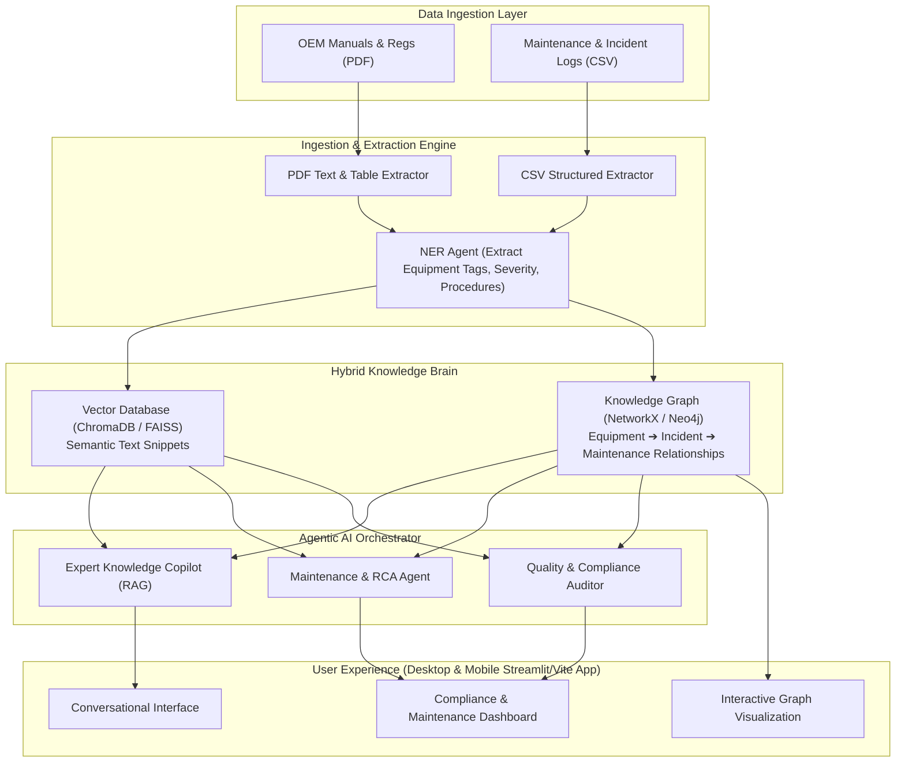

# Analysis: AI for Industrial Knowledge Intelligence (Unified Asset & Operations Brain)

This document provides a comprehensive analysis of the hackathon problem statement and defines a high-level solution architecture tailored to the provided raw datasets.

---

## 1. Core Problem Definition

Industrial facilities operate under high-risk, high-complexity conditions where critical operational data is fragmented across various disconnected silos. This fragmentation manifests in several ways:

1. **Information Fragmentation:** Critical documents (P&IDs, OEM manuals, regulatory guides, maintenance records, and safety/incident logs) are stored in disparate systems.
2. **Search Inefficiency:** Engineers and field technicians spend up to **35% of their working hours** locating manuals or verifying past procedures.
3. **Operational Risks:** Making maintenance or operational decisions without full historical context contributes to **18–22% of unplanned downtime**.
4. **Tribal Knowledge Loss:** The impending retirement of senior plant personnel threatens to deplete undocumented operational wisdom.

### Objective
Build a unified **Industrial Knowledge Intelligence Platform** that ingests heterogeneous raw files (PDFs, CSVs), maps their relationships using a Knowledge Graph + Vector Database, and provides intelligent, domain-aware agent workflows (Copilot, RCA, and Compliance auditing) accessible to both engineers (desktop) and field operators (mobile).

---

## 2. Analysis of the Raw Datasets (`data/raw/`)

We have analyzed the files currently residing in `data/raw/`. They fall into four main categories:

### A. OEM & Maintenance Manuals (Heavy Unstructured PDF)
*   `centrifugal-pump-acp-se-manual-v2-2-en-data.pdf` (10.6 MB)
*   `811_iom.pdf` (6.7 MB)
*   `IOM_manual_CTP.pdf` (2.6 MB)
*   `811cc-series-iom.pdf` (1.1 MB)
*   `user_manual_2023_NHVf_EN.pdf` (1.8 MB)
*   `1737029789_fa33f264822ba23a495f.pdf` (10.3 MB - likely drawing, schematic, or complex catalog)
*   `1776342005_56c5fa47e1d373e0a79d.pdf` (1.1 MB)
*   `b878b8d9f3d9abc62fbe0a6c92f606e3.pdf` (730 KB)
*   *Key Challenges:* Extracting hierarchical manuals (sections, chapters, diagrams, specs) and equipment tags (e.g., "P-101", "V-105").

### B. Regulatory & Safety Standards (Reference PDFs)
*   `factory_acta1948-63.pdf` (823 KB) – The Factories Act (India), defining safety and occupational rules.
*   `hsg245.pdf` (1.6 MB) – UK HSE guidelines on investigating accidents and incidents.
*   `Safety_occurrence_reporting_and_investigation.pdf` (550 KB)
*   `riddor-background-quality-report.pdf` (361 KB)
*   *Key Challenges:* Cross-referencing operational incidents against these acts to detect compliance violations.

### C. Maintenance Logs (Structured/Tabular CSV)
*   `maintenance_log_synthetic.csv` (6.7 KB)
*   *Columns:* `Log_ID`, `Date`, `Equipment_ID_Name`, `Maintenance_Type` (Preventive, Corrective, Emergency, Predictive), `Technician`, `Hours_Run_Since_Last_Maint`, `Observation_Remarks`, `Parts_Replaced`, `Downtime_Hours`, `Next_Scheduled_Maint`.
*   *Key Assets:* Links specific equipment (e.g., `Pump P-102`, `Control Valve V-105`, `Centrifugal Pump P-101`, `Reciprocating Compressor C-301`) to technicians, actions, and downtime.

### D. Incident & Near-Miss Logs (Structured/Tabular CSV)
*   `near_miss_incident_log_synthetic.csv` (6.5 KB)
*   *Columns:* `Report_ID`, `Date`, `Location` (Compressor Shed, Valve Yard, Pump House, Storage Tank Area, Control Room), `Severity` (Minor Injury, Property Damage, Near Miss - High Potential, Near Miss, First Aid), `Probable_Cause`, `Description`, `Reported_By`, `Corrective_Action`, `Status`.
*   *Key Assets:* Fuses location and severity to track systemic safety issues.

---

## 3. High-Level System Architecture

A robust solution requires an integration of RAG (Retrieval-Augmented Generation) and Knowledge Graphs:

---

## 4. Key Agent Workflows & Features

We plan to implement three specialized agent modules and expose them through a unified interface:

### 1. Unified Expert Copilot (RAG + KG)
*   **How it works:** Uses a hybrid search strategy. When a technician asks "How do I troubleshoot leakage in Pump P-102?", the retriever fetches semantic chunks from the OEM pump manuals and traverses the Knowledge Graph to retrieve the past maintenance records (e.g., `ML-1004` showing seal replacements) and near-miss logs associated with `Pump House` or `P-102`.
*   **Deliverable:** Source-attributed responses with confidence scores and direct links to the relevant PDF sections/rows of CSVs.

### 2. Root Cause Analysis (RCA) & Maintenance Intelligence Agent
*   **How it works:** When a failure or near-miss is reported (e.g., recurring vibration in `Reciprocating Compressor C-301`), the RCA agent runs a "5-Whys" structured diagnostic. It pulls:
    1. OEM troubleshooting guidelines.
    2. Historical failure frequency & downtime hours from `maintenance_log_synthetic.csv`.
    3. Near-miss correlations (e.g., PPE issues, operator errors in that location) from `near_miss_incident_log_synthetic.csv`.
*   **Deliverable:** An automated, structured RCA report recommending preventive actions, part replacement checks, and next scheduled maintenance windows.

### 3. Quality & Regulatory Compliance Intelligence Agent
*   **How it works:** Evaluates ongoing operations against safety acts (e.g., `factory_acta1948-63.pdf`). 
    *   *Example:* If a maintenance log shows a compressor downtime of 5 hours due to emergency repairs without safety incident logs filed, or if a minor injury occurred in `Pump House` and was marked "Open" for months, it flags the corresponding violation of the Factory Act (e.g., Section 88 on reporting accidents).
*   **Deliverable:** A real-time audit checklist highlighting gaps and auto-generating regulatory evidence packages.

---

## 5. Next Steps & Development Roadmap

Since all project files are currently empty shells, we will execute the implementation in phases:

### Phase 1: Environment & Directory Setup
*   Configure `requirements.txt` (install dependencies: LangChain/LlamaIndex, OpenAI/Gemini SDK, ChromaDB, NetworkX/PyVis, Streamlit, PyPDF2/pdfplumber, Pandas).
*   Implement `src/ingestion/pdf_loader.py` and `src/ingestion/excel_loader.py` to ingest the PDFs and CSVs.

### Phase 2: Knowledge Extraction & Storage
*   Implement `src/retrieval/vectorstore.py` to index chunked text.
*   Implement `src/knowledge_graph/graph_builder.py` using `networkx` or a lightweight DB to create nodes (Equipment, Incidents, Standard Procedures, Regulations) and edges.

### Phase 3: Agent Logics
*   Develop RAG query logic in `src/retrieval/retriever.py` and the agent wrappers in `src/agents/copilot.py` and `src/agents/rca_agent.py`.

### Phase 4: UI Development (`app.py`)
*   Build a responsive Streamlit application containing a Chat interface, an interactive Knowledge Graph visualization, and a Compliance/RCA dashboard.
